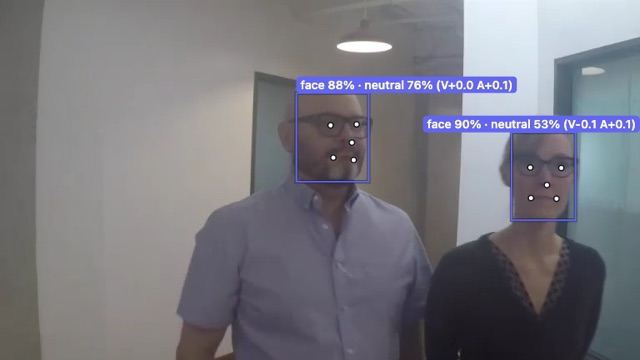
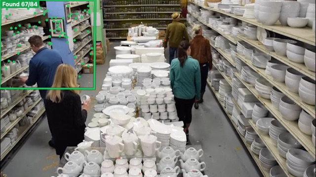
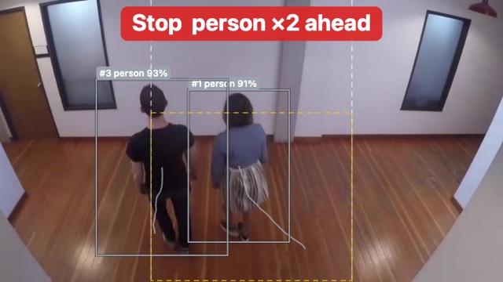

# CV Playground

[English](README.md) | **日本語**

画像認識（CV）のモデルを、ブラウザから手軽に試して比べるためのページ。
同じ画面で **「ブラウザ内で実行（その端末の WebGPU / WASM）」** と **「サーバーで実行」** を選べ、推論時間・fps・処理の内訳を見ながら、スマホや PC で実際にどこまで動くかを確かめられる。

**https://yoshiri.github.io/cv-playground/** で開ける（サーバーなし、ブラウザ実行のみ。スマホ可）。

画面は**日本語と英語**に対応している。ブラウザの言語に合わせて開き、上の「English / 日本語」のボタンで切り替えられる（ブラウザごとに覚える。URL に `?lang=ja` / `?lang=en` でも選べる）。


## デモ

| | | |
| --- | --- | --- |
| <br>**人物の姿勢 + 追跡**（YOLO26n-pose + ByteTrack。ID と軌跡） | <br>**物体検出**（YOLO26n） | <br>**手・目**（PINTO の DEIMv2 + 目の開閉 OCEC） |
| <br>**セマンティック・セグメンテーション**（EoMT DINOv3、ADE20K） | <br>**パノプティック・セグメンテーション**（EoMT DINOv3、COCO。椅子や机を1つずつ） | <br>**プロンプト・セグメンテーション**（SAM 2.1、クリックした人） |
| <br>**全体の自動分割**（EdgeTAM、144 点から） | <br>**深度推定**（Depth Anything 3、画角も推定） | <br>**テキスト物体検知**（Grounding DINO、「orange, lemon」） |
| <br>**ゼロショット分類**（SigLIP2） | <br>**背景除去**（BiRefNet lite） | <br>**顔 + 表情**（YuNet + HSEmotion。表情と快 V・覚醒度 A） |
| <br>**テンプレートマッチング**（XFeat + RANSAC。前のフレームで切り出した棚を、人が前を通っても見つける） | <br>**進む・止まる**（検出 + 深度 + 場面の判定。止まる理由つき） | |

（デモ画像は英語の画面で撮っている）

デモの映像は [intel-iot-devkit/sample-videos](https://github.com/intel-iot-devkit/sample-videos)（CC BY 4.0）の1フレーム。

## できること

### タスク（タブ。4つの分類）

| 分類 | タブ | できること |
| --- | --- | --- |
| 検出・追跡 | 物体検出 | COCO の 80 クラス（YOLO26、RF-DETR）。動画・カメラでは追跡も |
| | 人物の姿勢 | 17 点の骨格。追跡も |
| | 顔 | YuNet（顔の5点つき）。切り出した顔を HSEmotion で表情8種類と快・覚醒度に分ける |
| | 手・目（PINTO） | PINTO の超軽量モデルで体・頭・顔・目・手と、目の開閉・指差し・手を振る |
| | しぐさ（姿勢＋PINTO） | 両方を同じフレームで回し、手を挙げた・顔の向き・目を閉じている・指差しを人ごとに判定 |
| | テキスト物体検知 | Grounding DINO に英語の名詞で探す物を伝える |
| | テンプレートマッチング | 探す物を枠で切り出すかファイルで選び、XFeat の特徴点の対応とホモグラフィで探す。対応点を線で見られる |
| | 手ぶれ補正 | 前のフレームとの動きを XFeat で求め、なめらかにした（または止めた）カメラの軌跡で描き直す。補正前後の揺れを数字とグラフで出す |
| セグメンテーション | プロンプト（SAM） | SAM 2.1 / SAM 3 / EdgeTAM。クリックした点、または格子の点から全体を自動で分ける |
| | セマンティック・パノプティック | SegFormer / EoMT（ADE20K）、DETR / EoMT（COCO パノプティック。物を1つずつ） |
| | 背景除去 | BiRefNet |
| 深度・3D | 深度推定 | Depth Anything V2 / 3 |
| | 接近・後退 | 物体検出＋深度。追跡の ID ごとに小さなカルマンフィルタで近づく・遠ざかるを判定し、届くまでの時間とクラスごとの数を出す |
| | 3D の姿勢 | 姿勢＋深度。奥行きを付けた骨格を回して描く |
| | 進む・止まる | 物体検出・深度・場面の判定を同じフレームで回し、前に人・物、近づいてくる、前が近い、場面が「通れない」などで止まる。理由つき |
| 画像と言語 | ゼロショット分類 | SigLIP2。はい・いいえの判定も（下の「判定」） |
| | 画像の説明・質問 | SmolVLM / Qwen3-VL、または Ollama の画像対応モデル（サーバー版） |

### タスクの上に重ねる層

| 層 | できること |
| --- | --- |
| **判定** | ゼロショット分類のタブに「通れる \| 通れない」「安全 \| 危険」のような、はい・いいえの言葉を書くと画像に重ねる。動画では時間でならし（ヒステリシスつき）、切り替わりを記録する。進む・止まるは、これと検出・深度を組み合わせる |
| **応用** | 枠を返すタブに後付けする。クラスごとに数える（今の数と、追跡を選ぶと見えた ID の数の通算）、線を越えた数（画面に線を引き、追跡の ID が越えた回数を向きとクラスごとに数える。越えた時は出来事としても流す）。`?apps=count,line` で最初から選んだ状態で開く |
| **インタラクト** | 結果を決まった形のフレームにして外に流す。別のタブへ（BroadcastChannel）、WebSocket へ（サーバー版は `/ws` が中継。`tools/ws_receiver.py` で受け取れる）。ブラウザだけで動く CV のセンサーとして外のツールから使える。届いたフレームは `web/receiver.html` で確かめられ、一番大きく写っている人に合わせて動く Live2D 風のキャラを確認用に出す。`?interact=broadcast,websocket,puppet` で最初から選んだ状態で開く |

### そのほか

- **入力**: 見本の画像・動画（ボタンで選ぶ）、画像、動画ファイル、カメラのライブ映像（背面・前面や端末のカメラの一覧から選べる）。動画・カメラは連続実行して結果を重ね、fps と処理の内訳（取り込み・前処理・モデル実行・後処理）を出す。連続実行の間は画面を消さない
- **追跡**: ByteTrack / BoT-SORT / BoT-SORT + ReID（Ultralytics の実装を移植し、同じ検出列で結果が一致することを確認）
- **実行設定**: 汎用 ONNX のモデルは既定で fp16（fp16 版がある時）と WebGPU の graph capture（使えないモデルは自動で外す）。fp32・graph capture なし・CPU（WASM）にも切り替えられる。入力サイズ可変のモデルは入力の長辺（320〜960）を選べる
- **比べる**: 同じモデルをブラウザとサーバーで（汎用 ONNX は前処理・後処理を共通の部品で組むので同じ手順）。実行履歴に時間が残る
- **速度を測る（ベンチマーク）**: 決まったサンプル画像でウォームアップ 3 回のあと 5 / 20 / 50 / 100 回推論し、中央値・p90・p95・fps を記録。`?profile=1` で、汎用 ONNX のモデルは演算ごとの GPU 時間も出す（[docs/NOTES.md](docs/NOTES.md)）
- **手元の ONNX を使う**: 公開モデルのファイルを既に持っていれば、選ぶだけでダウンロードせずに使える（SHA-256 が完全に一致したファイルだけ。汎用 ONNX のモデルが対象）
- **書き出す**: 表示中の画像（説明の帯つき。スマホは共有シートから写真に保存）、結果データ（JSON）、実行の記録（CSV / JSON / Markdown の表。画面の言語で書く。端末・ブラウザ・GPU の情報つきで、別の端末の CSV をそのまま連結して比べられる）

## データ・通信・ライセンスについて

- **ブラウザで実行するモデルは、初回にその端末へダウンロードする**（数MB〜約1.4GB。モデル名の横に大きさを表示）。**モバイル回線では通信量に注意**。100MB を超えるモデルは初回に確認してから取得し、2回目以降はブラウザのキャッシュから読む。ページ下の「ダウンロード済みのモデルを消す」で消せる。キャッシュは開いたサイト（URL の配信元）ごとに別で、端末の容量が減ると消されることもある。**サーバー版では、モデルのファイルをサーバーが代わりに取って `models/mirror/` に保存して配る**ので、同じ tailnet・LAN の別の端末やキャッシュを消した端末でも、2 回目からはネットに取りに行かない（`?mirror=0` で使わない）。結果欄の「読み込み」の横に、どこから読んだか（ブラウザのキャッシュ・サーバー・ダウンロード）を出す
- **画像・動画・カメラの映像は、ブラウザで実行する限り端末の外に送らない**（通信はモデルとライブラリの取得だけ）。「サーバーで実行」を選んだ時だけ、その画像をサーバーに送る
- **モデルごとにライセンスが違う**（商用利用できないものもある。例: YOLO26 は AGPL-3.0、Depth Anything V2 Large と SegFormer は非商用）。画面のモデルの説明にライセンスを表示している
- 対応ブラウザ: WebGPU のある Chrome / Edge / Safari（iOS 26 以降）を推奨。WebGPU が無いと WASM で動くが遅い

## 使い方

### 配り方は3通り（どれも `web/` の同じコード）

| 配り方 | 中身 | 違い |
| --- | --- | --- |
| サーバー版 | `server.py` が `web/` と API を配る | サーバー（Mac など）で動くモデルも選べる。COOP/COEP ヘッダで WASM が複数スレッド |
| 静的版 | GitHub Pages などが `web/` をそのまま配る | API に届かないのでブラウザ実行のモデルだけ。WASM の複数スレッドは同梱の coi-serviceworker で有効にする |
| 1ファイル版 | `python3 build.py` で作る `dist/cv-playground.html` | ファイルを開くだけで動く（file:// 可）。ブラウザ実行のみ、WASM は1スレッド |

サーバーの有無はページが実行時に判定する（`api/models` に届くか）。

### サーバー版を動かす

```sh
uv venv --python 3.12 .venv && uv pip install --python .venv/bin/python -r requirements.txt
cp .env.example .env            # 環境ごとの設定（任意。.env は git に入れない）
scripts/serve.sh                # http://127.0.0.1:8010（--bg で裏で起動）
```

- サーバー側のモデルは初回に Hugging Face から取得する（合計で数GB）。最大3つをメモリに置き、超えたら古い順に外す
- 別の端末（スマホなど）から開く時は **https が必要**（WebGPU とカメラのため）。例えば Tailscale なら `tailscale serve --bg --https=8443 http://127.0.0.1:8010`
- Apple Silicon では MPS / CoreML を使う。ほかは CPU（CUDA は未対応・未検証）
- 入力サイズ可変の YOLO26 を使う時は `tools/export_yolo26_dynamic.py` で書き出す（重みが AGPL なのでリポジトリには入れず、サーバーだけが配る）

環境変数（`.env`）

| 変数 | 意味 | 既定 |
| --- | --- | --- |
| `CVPG_PORT` | 待ち受けポート | 8010 |
| `CVPG_MAX_LOADED` | 同時に読み込んでおくサーバーのモデル数 | 3 |
| `CVPG_OLLAMA_MODEL` | 「Ollama の VLM」で使うモデル | `qwen3-vl:8b` |
| `OLLAMA_HOST_URL` | Ollama の URL | `http://127.0.0.1:11434` |
| `CVPG_GPU_LOCK` | このファイルがあれば「GPU を別の処理が使用中」と画面に出す（任意） | なし |

## フォークして広げる

| やりたいこと | ドキュメント |
| --- | --- |
| モデルを足す（ブラウザ・サーバー） | [docs/ADDING_MODELS.md](docs/ADDING_MODELS.md) |
| タブ・設定欄・結果の見せ方を足す | [docs/ADDING_UI.md](docs/ADDING_UI.md) |
| 仕組み・実測・分かったこと | [docs/NOTES.md](docs/NOTES.md) |
| 今後の課題 | [docs/TODO.md](docs/TODO.md) |

多くの場合、`web/models.json` に1件書くだけで済む（素の ONNX なら前処理・後処理も JSON で組める）。

## 構成

| ファイル | 役割 |
| --- | --- |
| `web/models.json` | **タブ（tasks）とモデル（models）の定義。ブラウザとサーバーで共通** |
| `web/app.js` | 画面、動画・カメラの連続実行、追跡・cascade のつなぎ、実行履歴、ベンチマーク |
| `web/export.js` | 画像の保存、結果データ、実行の記録の書き出し（CSV / JSON / Markdown）、端末の情報、統計 |
| `web/renderers.js` | 結果の種類ごとの見せ方（枠・マスク・深度・色分け・分類・文章） |
| `web/judge.js` | 判定（ゼロショットの点数からはい・いいえ、時間でならす・ヒステリシス、進む・止まるの条件） |
| `web/i18n.js`・`web/i18n_en.js` | 画面の言語。日本語が元の文で、英語は辞書（文そのもの・数字の入る形・言い回し）でページの文字を変わるたびに置き換える。`models.json` の `*_en` の欄も使う |
| `web/apps.js` | タブの結果に後付けする応用（フレームをまたいだ集計と、その表示。例: 数える） |
| `web/interact.js` | インタラクトの層（フレームの形、出口＝BroadcastChannel・WebSocket、Live2D 風のキャラ） |
| `web/receiver.html` | 流したフレームを受け取って確かめるページ（デバッグ用） |
| `web/worker.js` | ブラウザ側の adapter（Web Worker。onnxruntime-web 用と transformers.js 用で Worker を分ける） |
| `web/onnx_generic.js` | ブラウザ側の汎用 ONNX（前処理・後処理の部品） |
| `web/tracker.js` | ByteTrack / BoT-SORT（+ ReID） |
| `adapters.py` | サーバー側の adapter（汎用 ONNX の部品は onnx_generic.js と同じ） |
| `server.py` | FastAPI。`web/` と `/api/run`・`/api/status`・`/api/unload`、`/local-models/`、`/mirror/`（モデルのファイルと見本の動画をディスクに保存して配る）、`/ws`（インタラクトの WebSocket の中継） |
| `build.py` | 1ファイル版を作る（作り忘れは `.github/workflows/check-dist.yml` が検出） |
| `web/pinto/` | 同梱した PINTO_model_zoo のモデル（MIT） |
| `web/stabilize.js` | 手ぶれ補正の画面側（軌跡・なめらかにする・切り抜き・揺れの指標） |
| `web/xfeat_gpu.js` | XFeat の後処理を GPU で（モデルの出力のバッファを WebGPU の compute shader でそのまま読む） |
| `web/xfeat.js` | XFeat の後処理とテンプレートマッチング（点・記述子・相互最近傍・ホモグラフィ。サーバーの `adapters.py` と同じ手順） |
| `tools/` | 追跡の Ultralytics との比較、YOLO26 の書き出し、モデルのファイルの SHA-256 の取得、XFeat の kornia・OpenCV との比較（`xfeat_check.py`。`requirements-dev.txt` が要る） |

## ライセンス

コードは MIT License（LICENSE）。**モデルの重みは原則として同梱せず、実行時に各配布元から取得する。各モデルのライセンスはそれぞれの配布元を確認すること**（例: YOLO26 は Ultralytics の AGPL-3.0）。
例外として `web/pinto/` に PINTO_model_zoo のモデル（MIT）を出典つきで同梱している。サンプル画像（街・サッカー・人物・顔・空港）は Hugging Face の [Xenova/transformers.js-docs](https://huggingface.co/datasets/Xenova/transformers.js-docs) から、サンプル動画（廊下・駐車場・歩く顔・店の通路・教室）は [intel-iot-devkit/sample-videos](https://github.com/intel-iot-devkit/sample-videos)（CC BY 4.0。画面にも出典を出す）から、実行時に読み込む（リポジトリには入れない）。README のデモ画像は [intel-iot-devkit/sample-videos](https://github.com/intel-iot-devkit/sample-videos)（CC BY 4.0）のフレームに結果を重ねたもの。
