# CV Playground

画像認識（CV）のモデルを、ブラウザから手軽に試して比べるためのページ。
同じ画面で **「ブラウザ内で実行（その端末の WebGPU / WASM）」** と **「サーバーで実行」** を選べ、推論時間・fps・処理の内訳を見ながら、スマホや PC で実際にどこまで動くかを確かめられる。

**https://yoshiri.github.io/cv-playground/** で開ける（サーバーなし、ブラウザ実行のみ。スマホ可）。

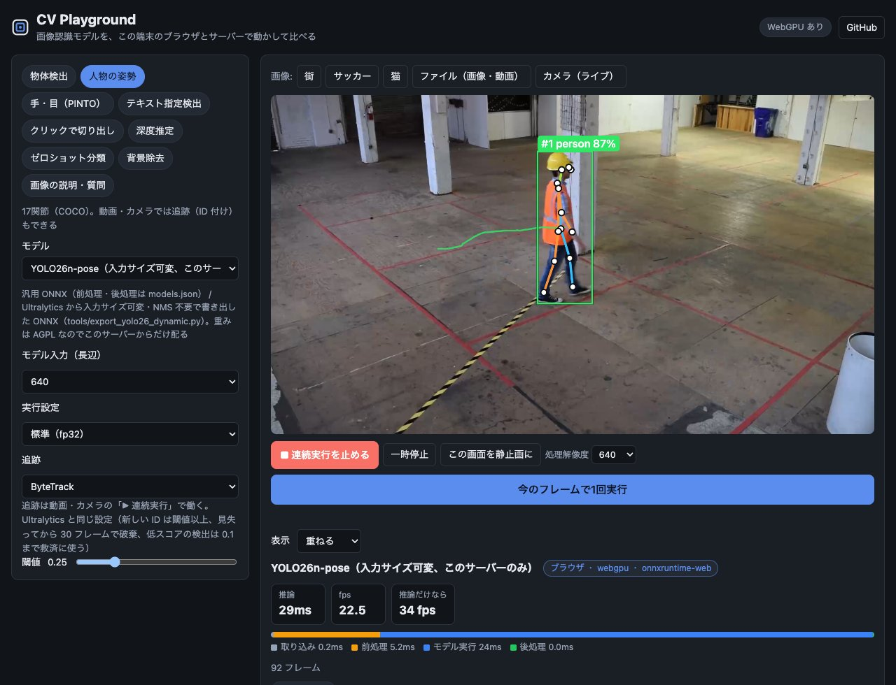

## デモ

| | | |
| --- | --- | --- |
| 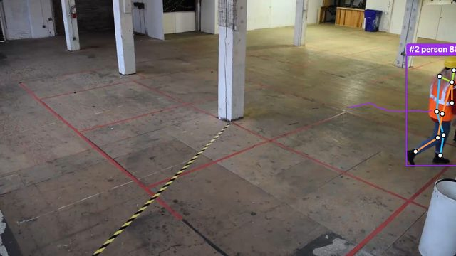<br>**人物の姿勢 + 追跡**（YOLO26n-pose + ByteTrack。ID と軌跡） | 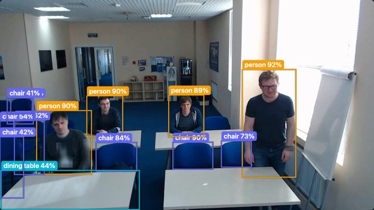<br>**物体検出**（YOLO26n） | 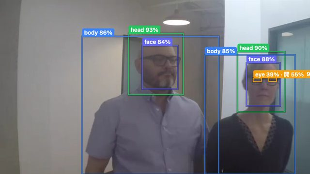<br>**手・目**（PINTO の DEIMv2 + 目の開閉 OCEC） |
| 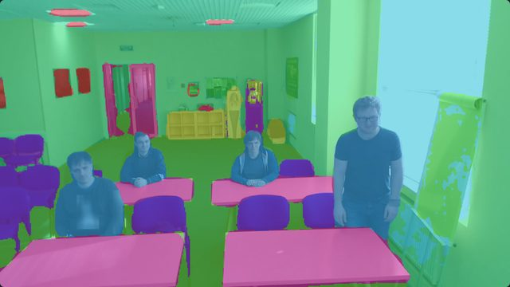<br>**セマンティック・セグメンテーション**（EoMT DINOv3、ADE20K） | 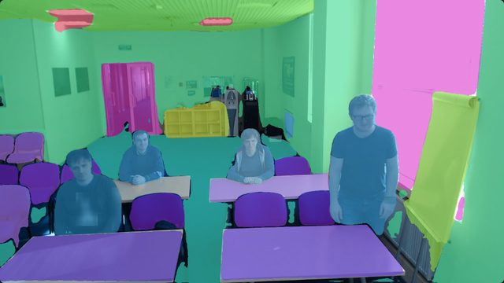<br>**パノプティック・セグメンテーション**（EoMT DINOv3、COCO。椅子や机を1つずつ） | 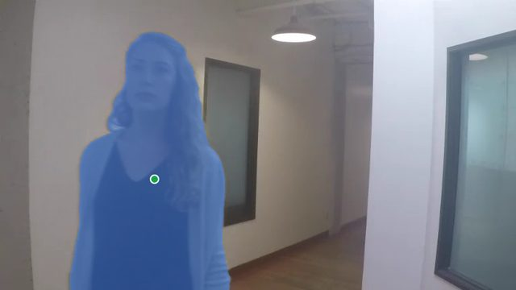<br>**プロンプト・セグメンテーション**（SAM 2.1、クリックした人） |
| 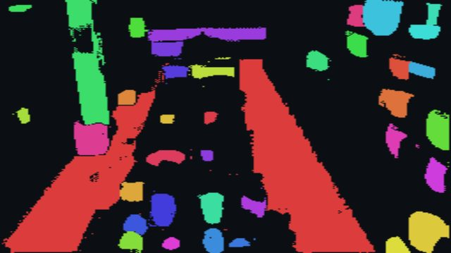<br>**全体の自動分割**（EdgeTAM、144 点から） | 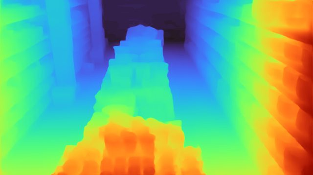<br>**深度推定**（Depth Anything 3、画角も推定） | 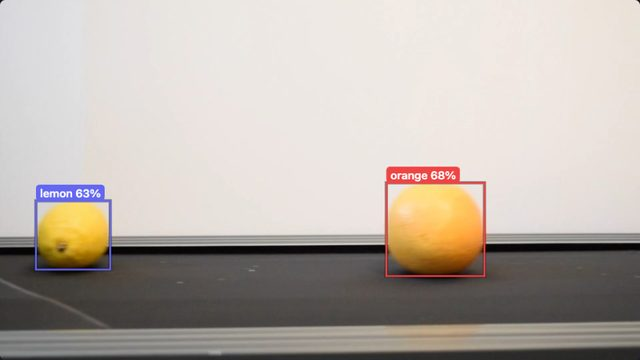<br>**テキスト物体検知**（Grounding DINO、「orange, lemon」） |
| 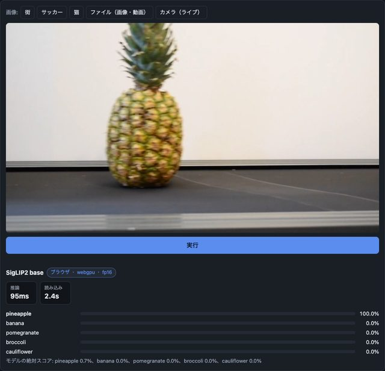<br>**ゼロショット分類**（SigLIP2） | 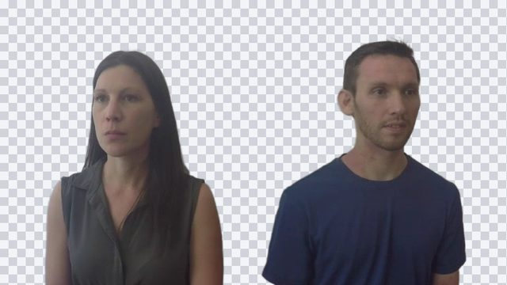<br>**背景除去**（BiRefNet lite） | |

デモの映像は [intel-iot-devkit/sample-videos](https://github.com/intel-iot-devkit/sample-videos)（CC BY 4.0）の1フレーム。

## できること

- **タスク**（4つの分類にまとめて表示）
  - 検出・追跡: 物体検出 / 人物の姿勢 / 手・目（PINTO の超軽量モデル）/ テキスト物体検知
  - セグメンテーション: プロンプト（SAM、クリックと全体の自動分割）/ セマンティック / パノプティック / 背景除去
  - 深度・3D: 深度推定
  - 画像と言語: ゼロショット分類 / 画像の説明・質問（VLM）
- **入力**: 画像、動画ファイル、カメラのライブ映像。動画・カメラは連続実行して結果を重ね、fps と処理の内訳（取り込み・前処理・モデル実行・後処理）を出す
- **追跡**: ByteTrack / BoT-SORT / BoT-SORT + ReID（Ultralytics の実装を移植し、同じ検出列で結果が一致することを確認）
- **実行設定**: fp16、WebGPU の graph capture、CPU（WASM）、入力サイズ可変のモデルは入力の長辺（320〜960）
- **比べる**: 同じモデルをブラウザとサーバーで（汎用 ONNX は前処理・後処理を共通の部品で組むので同じ手順）。実行履歴に時間が残る

## データ・通信・ライセンスについて

- **ブラウザで実行するモデルは、初回にその端末へダウンロードする**（数MB〜約1.4GB。モデル名の横に大きさを表示）。**モバイル回線では通信量に注意**。100MB を超えるモデルは初回に確認してから取得し、2回目以降はブラウザのキャッシュから読む。ページ下の「ダウンロード済みのモデルを消す」で消せる
- **画像・動画・カメラの映像は、ブラウザで実行する限り端末の外に送らない**（通信はモデルとライブラリの取得だけ）。「サーバーで実行」を選んだ時だけ、その画像をサーバーに送る
- **モデルごとにライセンスが違う**（商用利用できないものもある。例: YOLO26 は AGPL-3.0、Depth Anything V2 Large と SegFormer は非商用）。画面のモデルの説明にライセンスを表示している
- 対応ブラウザ: WebGPU のある Chrome / Edge / Safari（iOS 26 以降）を推奨。WebGPU が無いと WASM で動くが遅い

## 使い方

### 配り方は3通り（どれも `web/` の同じコード）

| 配り方 | 中身 | 違い |
| --- | --- | --- |
| サーバー版 | `server.py` が `web/` と API を配る | サーバー（Mac など）で動くモデルも選べる。COOP/COEP ヘッダで WASM が複数スレッド |
| 静的版 | GitHub Pages などが `web/` をそのまま配る | API に届かないのでブラウザ実行のモデルだけ。WASM の複数スレッドは同梱の coi-serviceworker で有効にする |
| 1ファイル版 | `python3 build.py` で作る `dist/cv-playground.html` | ファイルを開くだけで動く（file:// 可）。ブラウザ実行のみ、WASM は1スレッド |

サーバーの有無はページが実行時に判定する（`api/models` に届くか）。

### サーバー版を動かす

```sh
uv venv --python 3.12 .venv && uv pip install --python .venv/bin/python -r requirements.txt
cp .env.example .env            # 環境ごとの設定（任意。.env は git に入れない）
scripts/serve.sh                # http://127.0.0.1:8010（--bg で裏で起動）
```

- サーバー側のモデルは初回に Hugging Face から取得する（合計で数GB）。最大3つをメモリに置き、超えたら古い順に外す
- 別の端末（スマホなど）から開く時は **https が必要**（WebGPU とカメラのため）。例えば Tailscale なら `tailscale serve --bg --https=8443 http://127.0.0.1:8010`
- Apple Silicon では MPS / CoreML を使う。ほかは CPU（CUDA は未対応・未検証）
- 入力サイズ可変の YOLO26 を使う時は `tools/export_yolo26_dynamic.py` で書き出す（重みが AGPL なのでリポジトリには入れず、サーバーだけが配る）

環境変数（`.env`）

| 変数 | 意味 | 既定 |
| --- | --- | --- |
| `CVPG_PORT` | 待ち受けポート | 8010 |
| `CVPG_MAX_LOADED` | 同時に読み込んでおくサーバーのモデル数 | 3 |
| `CVPG_OLLAMA_MODEL` | 「Ollama の VLM」で使うモデル | `qwen3-vl:8b` |
| `OLLAMA_HOST_URL` | Ollama の URL | `http://127.0.0.1:11434` |
| `CVPG_GPU_LOCK` | このファイルがあれば「GPU を別の処理が使用中」と画面に出す（任意） | なし |

## フォークして広げる

| やりたいこと | ドキュメント |
| --- | --- |
| モデルを足す（ブラウザ・サーバー） | [docs/ADDING_MODELS.md](docs/ADDING_MODELS.md) |
| タブ・設定欄・結果の見せ方を足す | [docs/ADDING_UI.md](docs/ADDING_UI.md) |
| 仕組み・実測・分かったこと | [docs/NOTES.md](docs/NOTES.md) |
| 今後の課題 | [docs/TODO.md](docs/TODO.md) |

多くの場合、`web/models.json` に1件書くだけで済む（素の ONNX なら前処理・後処理も JSON で組める）。

## 構成

| ファイル | 役割 |
| --- | --- |
| `web/models.json` | **タブ（tasks）とモデル（models）の定義。ブラウザとサーバーで共通** |
| `web/app.js` | 画面、動画・カメラの連続実行、追跡・cascade のつなぎ、実行履歴 |
| `web/renderers.js` | 結果の種類ごとの見せ方（枠・マスク・深度・色分け・分類・文章） |
| `web/worker.js` | ブラウザ側の adapter（Web Worker。onnxruntime-web 用と transformers.js 用で Worker を分ける） |
| `web/onnx_generic.js` | ブラウザ側の汎用 ONNX（前処理・後処理の部品） |
| `web/tracker.js` | ByteTrack / BoT-SORT（+ ReID） |
| `adapters.py` | サーバー側の adapter（汎用 ONNX の部品は onnx_generic.js と同じ） |
| `server.py` | FastAPI。`web/` と `/api/run`・`/api/status`・`/api/unload`、`/local-models/` |
| `build.py` | 1ファイル版を作る（作り忘れは `.github/workflows/check-dist.yml` が検出） |
| `web/pinto/` | 同梱した PINTO_model_zoo のモデル（MIT） |
| `tools/` | 追跡の Ultralytics との比較、YOLO26 の書き出し |

## ライセンス

コードは MIT License（LICENSE）。**モデルの重みは原則として同梱せず、実行時に各配布元から取得する。各モデルのライセンスはそれぞれの配布元を確認すること**（例: YOLO26 は Ultralytics の AGPL-3.0）。
例外として `web/pinto/` に PINTO_model_zoo のモデル（MIT）を出典つきで同梱している。サンプル画像は Hugging Face の [Xenova/transformers.js-docs](https://huggingface.co/datasets/Xenova/transformers.js-docs) から実行時に読み込む。README のデモ画像は [intel-iot-devkit/sample-videos](https://github.com/intel-iot-devkit/sample-videos)（CC BY 4.0）のフレームに結果を重ねたもの。
